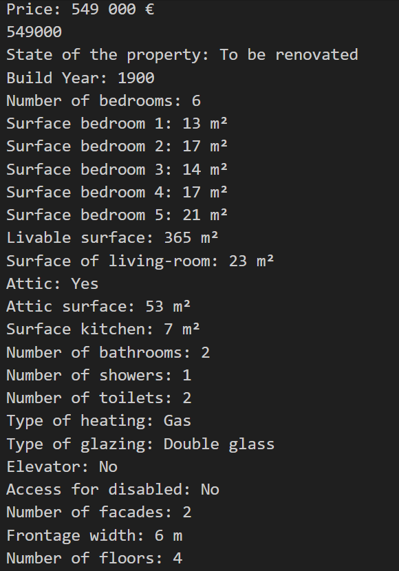
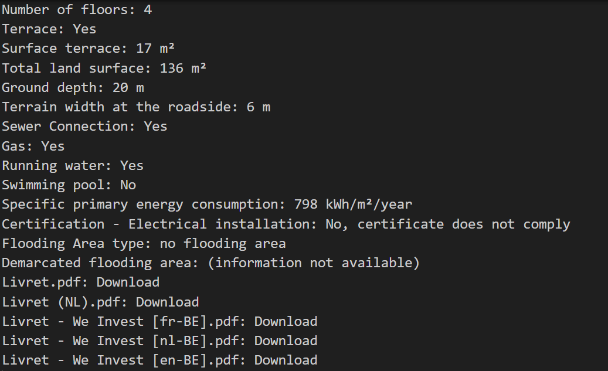

# challenge-collecting-data
# Description

Real estate company "ImmoEliza" wants to create a Machine Learning model to make price predictions on real estate sales in Belgium.

In that mission the first part is to get a dataset gathering information about at least 10.000 properties all over Belgium. This dataset will be used later as a training set for your prediction model.

I chose to scrape data from the famous https://immovlan.be/ website.

# Installation

github clone https://github.com/Manu1175/challenge-collecting-data.git
cd challenge-collecting-data

* Run with Python 3: python immo_scraper.py

# Usage

The dataset can be further used for data analisis and vizualisation.

# Visuals

Scraped information per property 